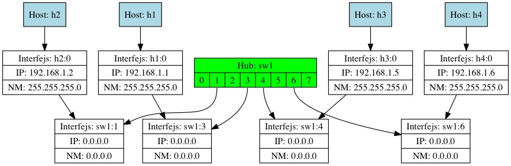

Koszek-Matyja Network Simulator
======

It's a simple simulator of the Ethernet network architecture.

You specify network topology in a text file, and run the simulator.
Simulator interprets the text file, and creates virtual hosts, its
interfaces, switches/hubs and their interfaces too. It then creates
connections between those.

Based on what has been requested in the configuration file, you can then
`ping` the a host from another one and observe the network activity spage by
stage.

Flow of data is documented in the "report file". Except from report file,
one can also visualize the topology of the network in
[Graphviz](http://www.graphviz.org/),
through the
[The DOT language](http://www.graphviz.org/doc/info/lang.html).

## Usage

Usage of `kmnsim` looks like this:

	Usage: kmnsim [-a] [-d] [-D <file] [-h] [-S <file>] [-T <file>] [-v]
	spec_file
	-a		direct summary (.out), .dot and .txt files to spec_file.EXT;
	-d		turn on debug mode;
	-D <file>	put Graphviz file to <file>
	-h		print this help
	-S <file>	put summary file to <file>
	-T <file>	put text (debug) file to <file>
	-v		turn verbose mode

If you want to get all output files to the same prefix path, use option
`-a`. For a debugging, you may want to turn a debugging mode with `-d`,
which will cause more debugging warnings to be printed out. If you want to
just get a .dot file (for graphing with Graphviz), use `-D` flag. `-h` will
print help. Both `-S` and `-T` are used for tracking how the flow of packets
happened in the network. The `-v` turns the verbose mode. One can specify
`-v` multiple tiles (e.g.: `-vv`) to get more verbose output.

## Examples

To generate a summary file, use:

	./kmnsim -d -v -S spec.4.i out4

Assuming you want to plot a configuration file from `spec.5.i` file.

For getting a `.dot` file, you:

	./kmnsim -d -v -D spec.4.u out4.dot

(later just use `dot -Tjpg -o out4.dot out4.jpg` to get an JPG file).
Example JPG file (which came from an input file `spec.11.i` in `conf/`
directory) may look like this:

## Configuration file syntax

Example configuration file looks like this (see spec/spec.4.i file):

	     1	host h1 create
	     2	host h2 create
	     3
	     4	iface h1 0 ip 192.168.1.1
	     5	iface h1 0 netmask 255.255.255.0
	     6	iface h1 0 mac a2:b1:c1:1:2:3
	     7
	     8	iface h2 0 ip 192.168.1.2
	     9	iface h2 0 netmask 255.255.255.0
	    10	iface h2 0 mac a3:c3:d3:a2:10:20
	    11
	    12	hub buh1 create
	    13
	    14	connect buh1 0 h1 0
	    15	connect buh1 1 h2 0

Following are the descriptions of individual lines:

a. Lines (1) and (2) create hosts `h1` and `h2` respectively
b. Lines (4--6) configure the interface `0` of host `h1` with IP address, the netmask and the physical MAC address
c. Lines (8--10) are like (b), but for host `h2`
d. Line (12) creates hub called `buh1`
e. Line (14) uses `connect` directive to connect hub's `buh1` interface `0` with host's `h1` interface 0.
f. Line (15) is like line (14), but for host `h2`

# Author

- Wojciech Adam Koszek, [wojciech@koszek.com](mailto:wojciech@koszek.com)
- [http://www.koszek.com](http://www.koszek.com)
